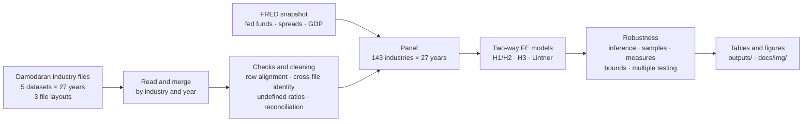

# Does the Payout–Leverage Relationship Vary with the Interest Rate Regime?

[](https://github.com/MilanKalajdzic/Master-Thesis/actions/workflows/tests.yml)
[](pyproject.toml)
[](LICENSE)

**When interest rates rise, do more indebted industries cut their payouts harder?**

<p align="center">
<picture>
  <source media="(prefers-color-scheme: dark)" srcset="docs/img/hero-dark.png">
  
</picture>
</p>

*The payout-on-leverage slope, year by year, over three rate cycles. If debt service crowded out payouts when
rates are high, the shaded years would sit lower; they don't. Pooled over all years, the slope is
+0.31 in low-rate years and +0.27 in high-rate years.*

Master's thesis in Quantitative Finance, Faculty of Economic Sciences, University of Warsaw.
Author: Milan Kalajdžić · Supervisor: dr hab. Piotr Boguszewski · *Work in progress*

The repository holds the whole empirical pipeline for 143 US non-financial industries
over 27 years (1999–2025): loading Damodaran's industry files, checking them, building
the panel, estimation, robustness, tables and figures. It uses only public data (Damodaran, NYU Stern and FRED),
so every number can be reproduced from scratch, and the pipeline is tested on fake data with known answers.

**Contents:** [Short version](#short-version) · [Hypotheses](#research-question-and-hypotheses) ·
[Data and method](#data-and-method) · Results: [leverage and payout](#leverage-and-payout) ·
[H2](#h2-a-bounded-null) · [other leverage measures](#other-leverage-measures) · [H3](#h3-not-supported) ·
[dividend smoothing](#dividend-smoothing) · [Data quality](#data-quality) ·
[Design decisions](#design-decisions-and-why) · [Setup](#setup-and-reproduce) · [Tests](#tests) ·
[Layout](#repository-layout) · [Limitations](#limitations)

## Short version

- **Leverage and payout move together.** More levered industries pay out more
  (+0.30, p = 0.034), against the substitution story behind H1. The link survives
  robust standard errors, firm weights and dropping the financial crisis, weakens when investment intensity is
  held fixed (+0.25, p = 0.09)
  and disappears in first differences: a slow-moving association, not a year-to-year response.
- **H2: the rate regime doesn't change it.** β₂ = −0.041 (p = 0.77). The 95% interval rules out regime effects
  larger than 0.044 in the payout ratio per SD of leverage
  (12% of the mean payout). The null holds in all 19 specifications
  and for four leverage measures, including Debt/EBITDA × the fed funds rate, the closest available proxy for
  interest burden.
- **H3: not supported.** The estimate points the other way (−1.09, p = 0.027), but it
  leans on the 2023–25 cycle and does not survive the multiple-testing adjustment (Romano–Wolf
  p = 0.076): an exploratory pattern.
- **Dividends are smoothed** (Lintner speed of adjustment 0.09–0.36 a year), and smoothing
  doesn't change with the regime either.
- **Damodaran's files needed fixing.** The pipeline detects, in code, a block of shifted rows in `wacc99`,
  net income scrambled across industries in `divfcfe07`, a depreciation break in the 2013–15 capex files, and
  definition changes in leverage (leases, 2013), PP&E and capital spending (2013).
- **Tested.** On fake files with a planted effect and planted defects, the pipeline recovers the effect and
  catches the defects; 46 tests run on every push, on Python 3.10–3.14.

## Research question and hypotheses

Does the relationship between corporate leverage and payout policy depend on whether interest rates are
high or low?

| | Hypothesis | Test | Expected |
|---|---|---|---|
| **H1** | More leveraged industries pay out less when rates rise (debt service crowds out distributions) | leverage × high-rate | < 0 |
| **H2** | The payout–leverage sensitivity is stronger in high-rate regimes *(main contribution)* | β₂ on leverage × high-rate | β₂ < 0 |
| **H3** | High asset tangibility stabilises the relationship across regimes (lower refinancing risk) | leverage × high-rate × tangibility | > 0 |

## Data and method



- **Panel:** 143 non-financial, non-utility US industries × 27 years (1999–2025),
  2,116 industry-years; a *stable core* of 46 industries present ≥ 20 years is used as a robustness sample.
- **Sources:** Damodaran industry files `divfund` (payout, ROE, market cap), `divfcfe` (dividends, FCFE),
  `wacc` (market leverage D/(D+E), tax rate), `dbtfund` (PP&E / total assets, book and lease-free leverage,
  EBITDA/EV, capital spending), `capex` (capex-based tangibility proxies); FRED (fed funds rate, 10y Treasury,
  BAA–AAA spread, real GDP).
- **Rate regime:** a year is *high-rate* if the annual-average fed funds rate is ≥ 3%, which gives three
  separate episodes (1999–2001, 2005–2007, 2023–2025). A post-2022 dummy and the continuous rate are
  reported as alternatives.
- **Tangibility (H3):** PP&E / total assets, as the industry's percentile rank within each year (the variable's
  definition changes over time, see [data quality](#data-quality)).
- **Model:** two-way fixed effects (industry and year), standard errors clustered by industry:

$$\text{payout}_{it}=\beta_1\,\text{lev}_{it}+\beta_2\,(\text{lev}_{it}\times\text{HighRate}_t)+\gamma_1\text{ROE}_{it}+\gamma_2\text{tax}_{it}+\gamma_3\text{size}_{it}+\alpha_i+\delta_t+\varepsilon_{it}$$

Year fixed effects absorb every variable that only varies over time (the regime dummy, GDP growth, the
credit spread). Those variables enter through interactions, or in a separate industry-FE-only specification.

## Results

Payout ratios are only defined for positive earnings, so industry-years with ROE ≤ 0 are excluded from the
payout-ratio models (1,893 observations). All results are associational.

### Leverage and payout

Leverage is *positively* related to payout: +0.298 (SE 0.141, p = 0.034) with industry and year
fixed effects. More levered industries pay out more, the opposite of the substitution (free-cash-flow) story
behind H1 and in line with the complementarity view. The estimate survives standard errors robust to common
shocks, weighting by the number of firms and dropping the financial crisis, but not first differences, where it
is small and imprecise (its interval still contains +0.30). Holding investment intensity fixed (capital
spending / assets) lowers it to +0.25 and p to
0.09, so part of the link runs through how much industries
invest. It is best read as a slow-moving, medium-run association, consistent with smoothed dividends, rather
than a year-to-year response ([stress test](outputs/tab_stress_leverage.csv)):

| Stress test | Leverage coef. | SE | p | β₂ (lev × high) | p | N |
|---|---:|---:|---:|---:|---:|---:|
| Industry-clustered SE (main) | +0.298 | 0.141 | 0.034 | −0.041 | 0.770 | 1893 |
| Two-way clustered SE | +0.298 | 0.151 | 0.049 | −0.041 | 0.764 | 1893 |
| Driscoll–Kraay SE (3 lags) | +0.298 | 0.111 | 0.007 | −0.041 | 0.771 | 1893 |
| First differences (+ year FE) | +0.107 | 0.337 | 0.751 | −0.061 | 0.647 | 1639 |
| Weighted by number of firms | +0.328 | 0.163 | 0.044 | −0.033 | 0.822 | 1893 |
| Excluding 2008–09 | +0.337 | 0.157 | 0.032 | −0.048 | 0.746 | 1746 |
| Growth control (capex intensity) | +0.253 | 0.151 | 0.093 | −0.068 | 0.635 | 1893 |

### H2: a bounded null

<p align="center">
<picture>
  <source media="(prefers-color-scheme: dark)" srcset="docs/img/h2_bounds-dark.png">
  
</picture>
</p>

The regime interaction is close to zero and nowhere near significance (β₂ = −0.041, SE 0.141,
p = 0.77); the leverage slope is +0.314 in low-rate years and +0.272 in high-rate
years. A null result is only informative if the test could have found a meaningful effect. The 95% interval
for β₂ is [−0.318, +0.236]. Scaled by the standard deviation of leverage (0.139), it rules out
regime effects larger than 0.044 in the payout ratio per 1 SD of leverage
(12% of the mean payout of 0.37); an equivalence test (TOST)
rejects effects above 0.038 at the 5% level. The test has 80% power only for effects
of about 0.055 (15% of the mean), so smaller effects cannot
be excluded. Across the other specifications the bound is 0.040–0.063, except the
post-2022 dummy (0.095), which uses the least regime variation
([table](outputs/tab_power_bounds.csv)).

<details>
<summary><b>All 19 specifications</b> (β₂, the leverage × regime term)</summary>

| Specification | Term | Coef. | SE | p | N |
|---|---|---:|---:|---:|---:|
| Main (two-way FE) | lev × high | −0.041 | 0.141 | 0.770 | 1893 |
| Stable core (46 industries) | lev × high | −0.089 | 0.176 | 0.614 | 1089 |
| Regime = post-2022 dummy | lev × high | −0.166 | 0.265 | 0.532 | 1893 |
| Continuous rate | lev × FFR | −0.004 | 0.033 | 0.914 | 1893 |
| DV = Dividends / FCFE | lev × high | −0.250 | 0.658 | 0.704 | 1601 |
| DV = (dividends + buybacks) / NI, 2013+ | lev × high | −0.450 | 1.051 | 0.669 | 894 |
| DV = Dividend yield (D/MC) | lev × high | +0.007 | 0.004 | 0.115 | 2086 |
| Two-way clustered SE | lev × high | −0.041 | 0.138 | 0.764 | 1893 |
| Excluding 2020–21 | lev × high | −0.069 | 0.149 | 0.643 | 1770 |
| Excluding 2008–09 | lev × high | −0.048 | 0.147 | 0.746 | 1746 |
| Growth control (capex intensity) | lev × high | −0.068 | 0.143 | 0.635 | 1893 |
| Lagged leverage | lev(t−1) × high | −0.043 | 0.161 | 0.787 | 1763 |
| Industry FE + macro controls | lev × high | −0.147 | 0.157 | 0.349 | 1893 |
| Without ROE | lev × high | −0.091 | 0.155 | 0.555 | 1907 |
| Backward elimination of controls | lev × high | −0.043 | 0.143 | 0.763 | 1893 |
| Payout as reported (incl. ROE ≤ 0) | lev × high | −0.018 | 0.138 | 0.894 | 2003 |
| Driscoll–Kraay SE | lev × high | −0.041 | 0.142 | 0.771 | 1893 |
| First differences | Δ(lev × high) | −0.061 | 0.133 | 0.647 | 1639 |
| Weighted by number of firms | lev × high | −0.033 | 0.147 | 0.822 | 1893 |

</details>

### Other leverage measures

H1 is about debt *service*, and market D/(D+E) is only a rough gauge of it: it moves with share prices and
includes capitalised leases from 2013 on. Interest coverage is only reported from 2022, so the closest panel
measure is Debt/EBITDA (debt relative to operating cash flow), built as D/(D+E) ÷ (EBITDA/EV) and checked against
Damodaran's own figure where he reports it. The positive leverage–payout relation holds for every measure, and
the regime interaction is null for every measure, including Debt/EBITDA × the fed funds rate, the nearest thing
to an interest-burden test ([table](outputs/tab_alt_leverage.csv)):

| Leverage measure | Leverage coef. | p | × high-rate | p | per 1 SD | 95% bound per SD | N |
|---|---:|---:|---:|---:|---:|---:|---:|
| Market D/(D+E), main (leases from 2013) | +0.298 | 0.034 | −0.041 | 0.770 | −0.006 | 0.044 | 1893 |
| Market D/(D+E), without leases | +0.327 | 0.017 | −0.050 | 0.740 | −0.007 | 0.046 | 1893 |
| Book D/(D+E) | +0.620 | < 0.001 | −0.009 | 0.915 | −0.002 | 0.029 | 1891 |
| Debt / EBITDA | +0.049 | 0.003 | −0.011 | 0.540 | −0.016 | 0.067 | 1890 |
| Debt / EBITDA × fed funds rate (per pp) |  |  | +0.000 | 0.975 | +0.000 | 0.011 | 1890 |

Two caveats. Debt/EBITDA and the payout ratio both have earnings in the denominator; with the dividend yield as
the dependent variable the Debt/EBITDA coefficient is zero (p = 0.89), so its positive link
with payout may be partly mechanical. Book leverage rises mechanically when payouts shrink book equity, and it is
missing where book equity is negative (restaurants and tobacco in recent years).

### H3: not supported

<p align="center">
<picture>
  <source media="(prefers-color-scheme: dark)" srcset="docs/img/h3_tangibility-dark.png">
  
</picture>
</p>

With tangibility measured as PP&E / total assets, the triple interaction is −1.09
(SE 0.49, p = 0.027). In high-rate years the leverage–payout slope *rises* by
0.47 (p = 0.04) for the least tangible industries (10th percentile) and *falls* by 0.42
(p = 0.12) for the most tangible (90th percentile). H3 expected tangible industries to be the stable ones.
The sign survives Driscoll–Kraay and two-way clustered errors, dropping 2020–21, weighting by firms, the
continuous rate, a time-invariant tangibility (−1.01,
p = 0.043) and two of the three capex-based
proxies (Net Cap Ex/Sales p = 0.027, Capital/Sales p = 0.039;
Cap Ex/Depreciation −0.17, p = 0.29).
PP&E and capital spending are correlated, but holding capital spending intensity fixed leaves the term at
−1.07 (p = 0.026),
so it is not investment intensity in disguise. It weakens to −0.97
(p = 0.07) without 2008–09 and is not significant in the stable core
(−0.60, p = 0.33)
([sensitivity](outputs/tab_H3_robustness.csv), [proxies](outputs/tab_H3_proxy_robustness.csv)).

Is it fragile? ([leave-one-out](outputs/tab_H3_leave_one_out.csv), [multiple testing](outputs/tab_multiple_testing.csv))

- *No single industry drives it.* Dropping any one of the 141 industries leaves the term between
  −1.25 and −0.87, significant at 5% in 138 cases and at
  10% in all.
- *It leans on the latest tightening cycle.* Dropping 1999–2001 or 2005–2007 leaves it at
  −1.33 (p = 0.04) and −1.28
  (p = 0.05); dropping 2023–2025 halves it to −0.60
  (p = 0.14). Dropping 2023 alone gives −0.71
  (p = 0.11), while every other single year keeps p < 0.05.
- *It does not survive the multiple-testing adjustment.* The industry-cluster bootstrap gives
  p = 0.047 unadjusted. Adjusted for testing H2 and H3 together, p = 0.054 (Holm)
  and 0.076 (Romano–Wolf); adjusted across the five tangibility measures,
  p = 0.18 (Romano–Wolf).

So H3 is not supported, and the opposite pattern (the payout–leverage link weakening in high-rate years for
asset-heavy industries and strengthening for asset-light ones) is exploratory: it comes mostly from the 2023–2025
cycle and is not established once the number of tests is accounted for. It is still a reason not to read the H2
null as "no effect anywhere": opposite responses may average out.

### Other findings

- The strong negative ROE coefficient is mechanical. ROE is negatively related to the payout ratio
  (−1.59, p < 0.001) and to Dividends/FCFE (−2.85, p < 0.001), but both
  contain net income in the denominator (FCFE includes net income). With dividend yield (dividends ÷ market cap),
  which contains no earnings, the ROE coefficient is +0.004 (p = 0.07): more
  profitable industries do not pay out less ([table](outputs/tab_roe_check.csv)). The leverage coefficient in the
  yield regression is not interpreted, because yield and D/(D+E) both contain market equity.
- The effective tax rate is negatively related to payout (−0.48, p = 0.004).
- Tangibility itself is not related to payout once industry effects are in (PP&E rank
  +0.15, p = 0.28). With the Cap Ex/Depreciation proxy it
  was negative (−0.075, p = 0.010), which mostly reflects
  investment intensity rather than asset tangibility.

### Dividend smoothing

Industry dividends adjust slowly toward a target payout (Lintner, 1956): the speed of adjustment is between
0.09 and 0.36 per year (pooled vs within estimates, which bracket the true value). The payout
*ratio* itself is far less persistent (0.13–0.43), because it moves with earnings.
Smoothing does not differ between rate regimes, and H1 tested in change form (do more levered industries cut
dividends more when rates are high or rising?) is not supported. These change models drop 2013, when
Damodaran's reclassification moves firms between industries ([table](outputs/tab_lintner.csv)):

| Change-form test of H1 | Coef. | SE | p | N |
|---|---:|---:|---:|---:|
| lev(t−1) × high-rate year | +0.0016 | 0.0039 | 0.675 | 1771 |
| lev(t−1) × hiking year (fed funds up ≥ 25bp) | +0.0015 | 0.0023 | 0.505 | 1771 |
| lev(t−1) × change in fed funds rate | +0.0006 | 0.0009 | 0.518 | 1771 |
| lev(t−1) × high-rate year, stable core | +0.0022 | 0.0030 | 0.465 | 1026 |

The thesis figures and every table are in [`outputs/`](outputs).

## Data quality

<p align="center">
<picture>
  <source media="(prefers-color-scheme: dark)" srcset="docs/img/data_alignment-dark.png">
  
</picture>
</p>

Every check below is code in the pipeline, not a manual fix, and each writes a table to `outputs/`.

- **Row alignment (1999).** An industry has the same number of firms in every file of a year, so matching
  firm counts confirm that each row belongs to its name. They match everywhere except in `wacc99`, where a
  block of 18 industries (Aluminum to Chemical (Specialty)) is shifted by one row: Auto & Truck, for example,
  carries Apparel's leverage (0.18 instead of 0.51). The counts catch 17 of them (plus one financial
  industry). The 18th, Cement & Aggregates, has the same number of firms as the neighbour whose data it carries;
  a second check catches it: everywhere else in that file-year, wacc's D/(D+E) is the very same number as
  dbtfund's market debt ratio, and here it is 0.34 against 0.13. Leverage and the tax rate are set to missing for these rows
  ([table](outputs/tab_data_check_alignment.csv)).
- **Cross-file check (2000, 2007).** `divfund`'s payout ratio should equal dividends ÷ net income
  from `divfcfe`; it does (within 5%) for 93–100% of industries in every year except
  2000 and 2007. In `divfcfe07` the net-income column does not match the listed industries.
  Measures built from `divfcfe` are excluded in those years ([table](outputs/tab_data_check_crossfile.csv)); the
  main payout variable comes from `divfund` and is unaffected.
- **Capex depreciation break (2013–2015).** In Damodaran's 2013–2015 capex files, industry depreciation
  roughly halves while capex does not (Total Market: $908bn in 2012 → $368bn in 2013 → $719bn in 2016).
  This inflates Cap Ex/Depreciation and scrambles the industry ranking, so the depreciation-based proxies
  (robustness checks for H3) are set to missing in those years ([figure](outputs/fig_data_check_tangibility.png),
  [table](outputs/tab_data_check_yearly_medians.csv)).
- **Leverage and leases (2013).** From 2013 on, `wacc`'s D/(D+E) capitalises operating leases (it equals
  `dbtfund`'s lease-adjusted ratio exactly); before 2013 it equals the unadjusted ratio. The main leverage measure
  therefore changes definition in 2013, most for lease-heavy industries. Since 2019 (ASC 842) leases are on the
  balance sheet and the two ratios almost coincide. The lease-free ratio gives the same results.
- **PP&E / assets (2013, 2016, 2017).** `dbtfund` reports Fixed Assets / BV of Capital (1999–2012), Fixed Assets /
  Total Assets (2013–2016) and Net PP&E / Total Assets (2017+). The median drifts down over time and the industry
  ordering reshuffles in 2013 and 2016 (rank correlation with the previous year 0.78 and 0.83, against 0.96–0.99
  otherwise, [table](outputs/tab_data_check_ppe_rank_stability.csv)). Tangibility is therefore used as a
  within-year percentile rank, and the time-invariant H3 variant averages over the reshuffles.
- **Capital spending (2013).** The growth / reinvestment control is scaled by book capital up to 2012 and by
  total assets from 2013, so its median halves in 2013. Like PP&E it enters as a within-year percentile rank.
- **Debt / EBITDA.** Damodaran reports it only in 2018 and 2022+, so it is built from D/(D+E) and EBITDA/EV. In
  the years where both exist the two rank industries alike (rank correlation 0.87–0.96); the constructed level is
  about 10–20% lower because EV nets out cash ([table](outputs/tab_data_check_debt_ebitda.csv)). Interest
  coverage, the direct measure of debt-service burden, exists only from 2022 on and is not used.
- **Undefined ratios.** Payout (dividends ÷ earnings), Dividends/FCFE and total payout ÷ net income are
  meaningless when the denominator is ≤ 0, yet the files report values there: 110 loss-making industry-years
  have a median payout of 0.003 although they pay dividends, and 318 have a negative Dividends/FCFE. These are
  set to missing (`POSITIVE_DENOMINATORS` in the configuration); the as-reported payout is kept as a
  robustness check.
- **Industry reclassification (2012→2013).** Damodaran moved to a new industry scheme. Names are
  reconciled with a conservative rename map ([Appendix B](outputs/appendix_B_rename_map.csv)), and the
  stable-core sample checks that nothing hinges on it.
- **Three file layouts.** Sheet names, header rows and column names change across 1999–2012, 2013–2018 and
  2019+. The loader finds the table, the columns and the data year automatically.

## Design decisions (and why)

1. **Industry level, public data.** Damodaran's industry averages are free, so anyone can rerun everything.
   The price is that firm-level heterogeneity is averaged away (see [limitations](#limitations)).
2. **The regime is a rate threshold, not a date.** Fed funds ≥ 3% (annual average) gives three separate
   high-rate episodes; a post-2022 dummy would compare one episode with 23 very different years. Both, and the
   continuous rate, are reported.
3. **Two-way fixed effects with industry-clustered errors.** Industry effects remove permanent differences
   between sectors, year effects remove everything common to a year (including the regime itself, which then
   enters only through interactions). Driscoll–Kraay errors, two-way clustering and a cluster bootstrap check
   the inference.
4. **Undefined ratios are missing, not small.** A payout ratio with negative earnings, Dividends/FCFE with
   negative FCFE or book leverage with negative book equity carry no information about the concept.
5. **Ranks where a definition changes.** PP&E / assets and capital spending are compared within each year,
   because their definitions change over time; year effects cannot absorb a change that reorders industries.
6. **A null is reported as a bound.** Confidence intervals, the minimum detectable effect and an equivalence
   test say how large an effect the data rule out, instead of "no effect".
7. **Many tests, adjusted.** The H3 result is re-estimated without each industry, year and episode, and its
   p-value is adjusted for the other tests (Holm, Romano–Wolf), because it emerged from a long specification list.
8. **Checks are code.** Firm counts, identities between files and per-year medians are computed on every run,
   so a new download that breaks something is caught.
9. **The notebook decides, the package works, the tests check.** The notebook holds the research choices and
   the narrative; `src/paylev` holds the machinery; the tests run both on fake data with known answers.

## Setup and reproduce

Linux or macOS (on Windows, use `.venv\Scripts\python` in place of `.venv/bin/python`):

```bash
git clone https://github.com/MilanKalajdzic/Master-Thesis.git
cd Master-Thesis
python3 -m venv .venv
.venv/bin/python -m pip install -e ".[dev]"        # the package in src/, plus notebook and test tools
.venv/bin/python -m pytest                         # under a minute, on fake data: no downloads needed
.venv/bin/python scripts/download_damodaran.py     # 135 files -> data/raw/  (see data/README.md)
.venv/bin/python scripts/run_notebook.py           # reruns the notebook in place; tables and figures -> outputs/
.venv/bin/python scripts/readme_figures.py         # redraws the README figures -> docs/img/
```

For the exact package versions behind the committed outputs, run
`.venv/bin/python -m pip install -r requirements-lock.txt` before the `-e ".[dev]"` step.
`scripts/run_notebook.py` runs the notebook with the venv's Python from the repo root, whatever Jupyter kernels
are registered on the machine. In VS Code, open the repo folder and pick the `.venv` kernel; if the package isn't
installed, the notebook falls back to the copy in `src/`.

FRED data come from a pinned snapshot (`data/fred/fred_snapshot.csv`, vintage 2026-09-28), so results
match exactly. Set `FRED_SOURCE = "live"` in the configuration cell to download the current vintage
(needs the `fred` extra). A full run takes under a minute; the bootstrap in §10b is seeded (`RW_SEED`), so it
reproduces too.

### Tests

The tests need no downloads. `paylev.synthetic` writes fake Damodaran files for 1999–2025 in the same three
layouts as the real archive, with the real column names of each era, and plants in them:

- a known effect: payout = … + 0.3 × leverage − 0.4 × leverage × high-rate year − 1.0 × ROE + noise;
- the defects found in the real files: a block of rows shifted against the industry names (as in `wacc99`),
  including one row whose neighbour has the same firm count, and a year with net income scrambled across
  industries (as in `divfcfe07`);
- a financial and a utility industry, an industry renamed at the 2013 reclassification, and a newest file
  without year digits.

The whole notebook then runs on these files (`tests/test_notebook.py`). It has to finish without errors,
write every output the repo ships, recover the planted coefficients and catch every planted defect, and the
README figures are drawn from its outputs. So a null result on the real data can't come from a pipeline that is
unable to find an effect. Unit tests cover the file readers across layouts, the alignment and cross-file
checks, the estimators (the fast estimator used for the refits must equal PanelOLS, standard errors included),
Holm and Romano–Wolf, and the download script against a fake server. GitHub Actions runs them on every push, on
Python 3.10, 3.12 and 3.14, and on 3.11 with the pinned versions.

## Repository layout

```
thesis_analysis.ipynb        the analysis, top to bottom (sections map to thesis chapters 4-6 and appendices)
src/paylev/
  damodaran.py               find and read Damodaran's files across their three layouts, one year's rows
  sample.py                  reconciliation, exclusions, row-alignment and cross-file checks, winsorising
  macro.py                   FRED: pinned snapshot or live download, annual averages, the rate regime
  estimation.py              two-way FE panel regressions (PanelOLS) and a fast numpy version for refits
  inference.py               Holm, Romano-Wolf and the industry-cluster bootstrap
  synthetic.py               fake Damodaran files with planted effects and defects, for the tests
  plotting.py                figure style shared by the thesis and README figures (colours, themes, PNG export)
tests/                       pytest suite (no downloads needed)
scripts/
  download_damodaran.py      fetches the 135 Damodaran industry files (5 datasets, 1999-2025)
  run_notebook.py            reruns the notebook with this Python, from the repo root
  readme_figures.py          draws the README figures (light and dark) from outputs/
  refresh_fred_snapshot.py   re-downloads the FRED series into the snapshot
data/
  raw/                       Damodaran .xls files (not committed; downloaded)
  fred/fred_snapshot.csv     FRED monthly/quarterly series used in the thesis
outputs/                     regression tables (CSV + LaTeX), robustness tables, appendices, thesis figures
docs/img/                    README figures
pyproject.toml               the package, its dependencies and the dev/fred extras
requirements-lock.txt        exact versions behind the committed outputs
```

## Limitations

- Industry aggregation hides firm heterogeneity: the data are a repeated cross-section of industry averages,
  not a firm panel, and any regime dependence at the firm level may average out.
- Three high-rate episodes are few; the H3 pattern rests mostly on the last one.
- Tangibility (PP&E / assets) and capital spending change definition over time, so only their within-year
  ranking is used.
- Payout ratios are noisy when earnings are near zero (winsorised at 1%/99%).
- Identification is associational, not causal.

## License and data

Code: Apache-2.0 (see `LICENSE`). Data belong to their providers: Aswath Damodaran (NYU Stern, industry
datasets) and the Federal Reserve Bank of St. Louis (FRED).
