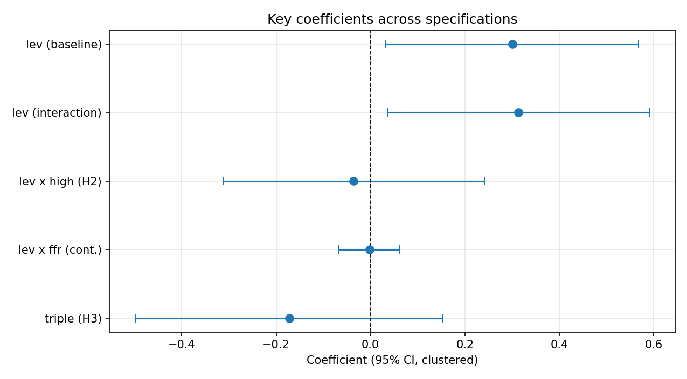

# Does the Payout–Leverage Relationship Vary with the Interest Rate Regime?

**Industry-Level Evidence from US Non-Financial Firms, 1999–2025**

Master's thesis in Quantitative Finance, Faculty of Economic Sciences, University of Warsaw.
Author: Milan Kalajdžić · Supervisor: dr hab. Piotr Boguszewski · *Work in progress*

This repository contains the full empirical pipeline: data loading, sample construction, estimation,
robustness checks, tables and figures. It uses only public data (Damodaran, NYU Stern and FRED), so
every number can be reproduced from scratch.

---

## Research question and hypotheses

Does the relationship between corporate leverage and payout policy depend on whether interest rates are
high or low?

| | Hypothesis | Test | Expected |
|---|---|---|---|
| **H1** | More leveraged industries pay out less when rates rise (debt service crowds out distributions) | leverage × high-rate | < 0 |
| **H2** | The payout–leverage sensitivity is stronger in high-rate regimes *(main contribution)* | β₂ on leverage × high-rate | β₂ < 0 |
| **H3** | High asset tangibility stabilises the relationship across regimes (lower refinancing risk) | leverage × high-rate × tangibility | > 0 |

## Data and method

- **Panel:** 143 non-financial, non-utility US industries × 27 years (1999–2025), 2,116 industry-years;
  a *stable core* of 46 industries present ≥ 20 years is used as a robustness sample.
- **Sources:** Damodaran industry files `divfund` (payout, ROE, market cap), `divfcfe` (dividends, FCFE),
  `wacc` (market leverage D/(D+E), tax rate), `capex` (tangibility proxy); FRED (fed funds rate,
  10y Treasury, BAA–AAA spread, real GDP).
- **Rate regime:** a year is *high-rate* if the annual-average fed funds rate is ≥ 3%, which gives three
  separate episodes (1999–2001, 2005–2007, 2023–2025). A post-2022 dummy and the continuous rate are
  reported as alternatives.
- **Model:** two-way fixed effects (industry and year), standard errors clustered by industry:

$$\text{payout}_{it}=\beta_1\,\text{lev}_{it}+\beta_2\,(\text{lev}_{it}\times\text{HighRate}_t)+\gamma_1\text{ROE}_{it}+\gamma_2\text{tax}_{it}+\gamma_3\text{size}_{it}+\alpha_i+\delta_t+\varepsilon_{it}$$

Year fixed effects absorb every variable that only varies over time (the regime dummy, GDP growth, the
credit spread). Those variables enter through interactions, or in a separate industry-FE-only specification.

## Results (current)

Payout ratios are only defined for positive earnings, so industry-years with ROE ≤ 0 are excluded from the
payout-ratio models (1,905 observations; see the data-quality notes).

**Leverage and payout.** Leverage is *positively* related to payout: +0.300 (SE 0.137, p = 0.028) with
industry and year fixed effects. More levered industries pay out more, the opposite of the substitution
(free-cash-flow) story behind H1 and in line with the complementarity view.

**H2: not supported.** The regime interaction is close to zero and nowhere near significance
(β₂ = −0.036, SE 0.141, p = 0.80); the leverage slope is +0.314 in low-rate years and +0.278 in high-rate
years. The null holds in every specification:

| Specification | Term | Coef. | SE | p | N |
|---|---|---:|---:|---:|---:|
| Main (two-way FE) | lev × high | −0.036 | 0.141 | 0.801 | 1905 |
| Stable core (46 industries) | lev × high | −0.085 | 0.175 | 0.627 | 1098 |
| Regime = post-2022 dummy | lev × high | −0.167 | 0.264 | 0.528 | 1905 |
| Continuous rate | lev × FFR | −0.002 | 0.033 | 0.943 | 1905 |
| DV = Dividends / FCFE | lev × high | −0.266 | 0.655 | 0.685 | 1612 |
| Two-way clustered SE | lev × high | −0.036 | 0.138 | 0.796 | 1905 |
| Excluding 2020–21 | lev × high | −0.063 | 0.149 | 0.671 | 1782 |
| Lagged leverage | lev(t−1) × high | −0.047 | 0.159 | 0.767 | 1774 |
| Industry FE + macro controls | lev × high | −0.143 | 0.157 | 0.363 | 1905 |
| Backward elimination of controls | lev × high | −0.037 | 0.143 | 0.794 | 1905 |
| Payout as reported (incl. ROE ≤ 0) | lev × high | −0.011 | 0.138 | 0.935 | 2015 |

**How large an effect can we rule out?** A null result is only informative if the test could have found a
meaningful effect. In the main specification the 95% interval for β₂ is [−0.312, +0.241]. Scaled by the
standard deviation of leverage (0.138), this rules out regime effects larger than 0.043 in the payout ratio per
1 SD of leverage (12% of the mean payout of 0.37); an equivalence test (TOST) rejects effects above 0.037 at the
5% level. The test has 80% power only for effects of about 0.055 (15% of the mean), so smaller effects cannot be
excluded. Across the other specifications the bound is 0.039–0.062, except the post-2022 dummy (0.094), which
uses the least regime variation ([table](outputs/tab_power_bounds.csv)).

**H3: not supported.** With the primary tangibility proxy the triple interaction is −0.172 (SE 0.166,
p = 0.30). The two alternative proxies give *significantly negative* terms (Net Cap Ex/Sales p = 0.029,
Capital/Sales p = 0.039), the opposite of H3's prediction: if anything, the payout–leverage link weakens more in
high-rate years for capital-intensive industries.

**Other findings.**
- Profitability (ROE) is strongly negatively related to the payout ratio (−1.59, p < 0.001), and also to
  Dividends/FCFE (−2.85, p < 0.001). Both ratios contain net income in the denominator (FCFE includes net
  income), so part of this relationship may be mechanical; neither check separates the two.
- The effective tax rate is negatively related to payout (−0.52, p = 0.001).
- More capital-intensive industries pay out less (tangibility main effect −0.077, p = 0.008), and pay out
  relatively more in high-rate years (tangibility × high-rate +0.064, p = 0.044).

**Dividend smoothing (Lintner, 1956).** Industry dividends adjust slowly toward a target payout: the speed of
adjustment is between 0.09 and 0.36 per year (pooled vs within estimates, which bracket the true value), with a
target payout of 0.28, close to the median payout ratio. The payout *ratio* itself is far less persistent
(0.13–0.43), because it moves with earnings. Smoothing does not differ between rate regimes, and H1 tested
in change form (do more levered industries cut dividends more when rates are high or rising?) is not supported.
These change models drop 2013, when Damodaran's reclassification moves firms between industries (industry
dividends jump by a median 42% that year vs 10–20% otherwise):

| Change-form test of H1 | Coef. | SE | p | N |
|---|---:|---:|---:|---:|
| lev(t−1) × high-rate year | +0.0016 | 0.0039 | 0.675 | 1771 |
| lev(t−1) × hiking year (fed funds up ≥ 25bp) | +0.0015 | 0.0023 | 0.505 | 1771 |
| lev(t−1) × change in fed funds rate | +0.0006 | 0.0009 | 0.518 | 1771 |
| lev(t−1) × high-rate year, stable core | +0.0022 | 0.0030 | 0.465 | 1026 |

Interpretation: over three full rate cycles, more levered industries pay out more, industry dividends are
smoothed, and neither the payout–leverage link nor the smoothing re-rates with the cost of debt beyond the bounds
above. Any regime dependence most plausibly lives at the firm level and averages out across industries.
All results are associational.

<p align="center"></p>

## Data-quality notes

- **Capex depreciation break (2013–2015).** In Damodaran's 2013–2015 capex files, industry depreciation
  roughly halves while capex does not (Total Market: $908bn in 2012 → $368bn in 2013 → $719bn in 2016).
  This inflates Cap Ex/Depreciation and scrambles the industry ranking, so depreciation-based tangibility
  is set to missing in those years ([figure](outputs/fig_data_check_tangibility.png),
  [table](outputs/tab_data_check_yearly_medians.csv)).
- **Industry reclassification (2012→2013).** Damodaran moved to a new industry scheme. Names are
  reconciled with a conservative rename map ([Appendix B](outputs/appendix_B_rename_map.csv)), and the
  stable-core sample checks that nothing hinges on it.
- **Cross-file check (2000, 2007).** `divfund`'s payout ratio should equal dividends ÷ net income from
  `divfcfe`; it does (within 5%) for 91–100% of industries in every year except 2000 and 2007. In
  `divfcfe07` the net-income column does not match the listed industries. Measures built from `divfcfe`
  are excluded in those years ([table](outputs/tab_data_check_crossfile.csv)); the main payout variable
  comes from `divfund` and is unaffected.
- **Undefined ratios.** Payout (dividends ÷ earnings), Dividends/FCFE and total payout ÷ net income are
  meaningless when the denominator is ≤ 0, yet the files report values there: 110 loss-making industry-years
  have a median payout of 0.003 although they pay dividends, and 318 have a negative Dividends/FCFE. These are
  set to missing (`POSITIVE_DENOMINATORS` in the configuration); the as-reported payout is kept as a
  robustness check.
- **Heterogeneous layouts.** File layouts differ across three eras (sheet names, header rows, column
  names). The loader finds the table, the columns and the data year automatically.

## Reproduce

```bash
git clone https://github.com/MilanKalajdzic/Master-Thesis.git
cd Master-Thesis
pip install -r requirements.txt
python scripts/download_damodaran.py      # 108 files -> data/raw/  (see data/README.md)
jupyter nbconvert --to notebook --execute --inplace thesis_analysis.ipynb
```

Or open `thesis_analysis.ipynb` and run all cells. Tables and figures are written to `outputs/`.
FRED data come from a pinned snapshot (`data/fred/fred_snapshot.csv`, vintage 2026-09-28), so results
match exactly. Set `FRED_SOURCE = "live"` in the configuration cell to download the current vintage.

## Repository layout

```
thesis_analysis.ipynb        full pipeline (sections map to thesis chapters 4-6 and appendices)
scripts/
  download_damodaran.py      fetches the 108 Damodaran industry files (1999-2025)
  refresh_fred_snapshot.py   re-downloads the FRED series into the snapshot
data/
  raw/                       Damodaran .xls files (not committed; downloaded)
  fred/fred_snapshot.csv     FRED monthly/quarterly series used in the thesis
outputs/                     regression tables (CSV + LaTeX), robustness tables, appendices, figures
```

## Limitations

Industry aggregation hides firm heterogeneity. The data are a repeated cross-section of industry
averages, not a firm panel. Tangibility is a flow-based proxy. Payout ratios are noisy when earnings are
near zero (winsorised at 1%/99%). Identification is associational, not causal.

## License

Code: Apache-2.0 (see `LICENSE`). Data belong to their providers: Aswath Damodaran (NYU Stern) and the
Federal Reserve Bank of St. Louis (FRED).
