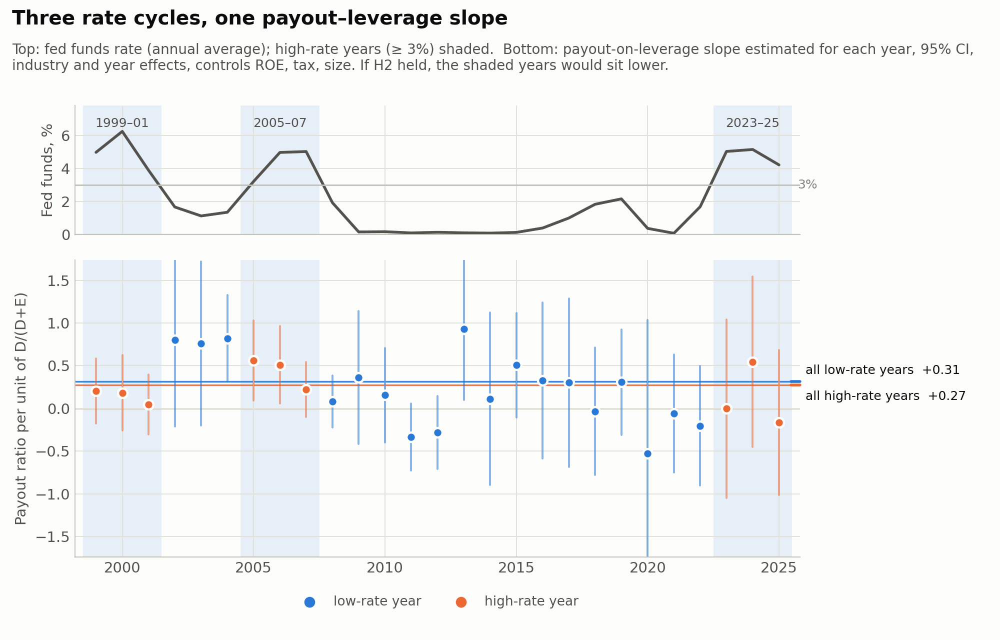
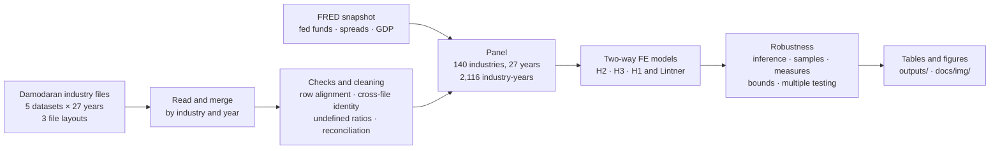
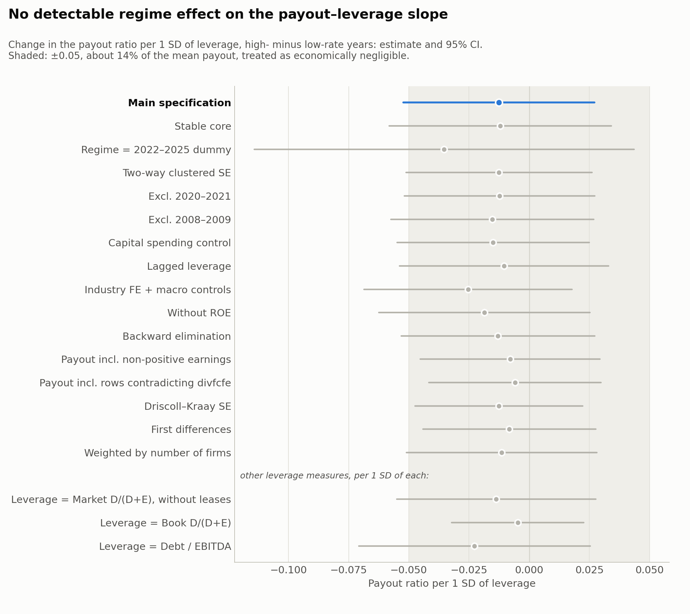
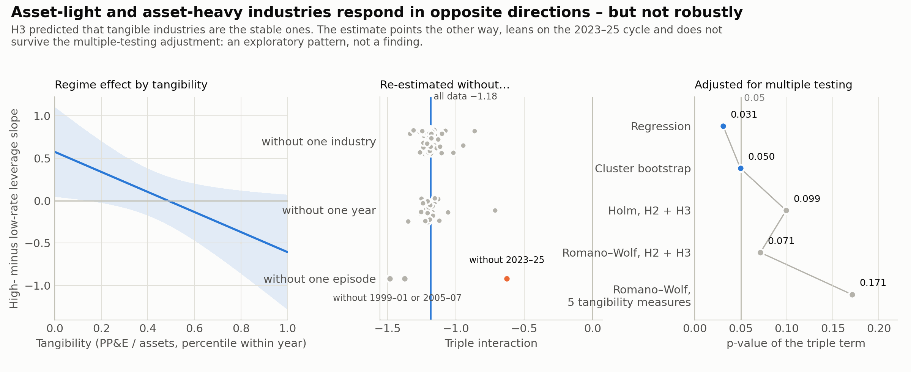
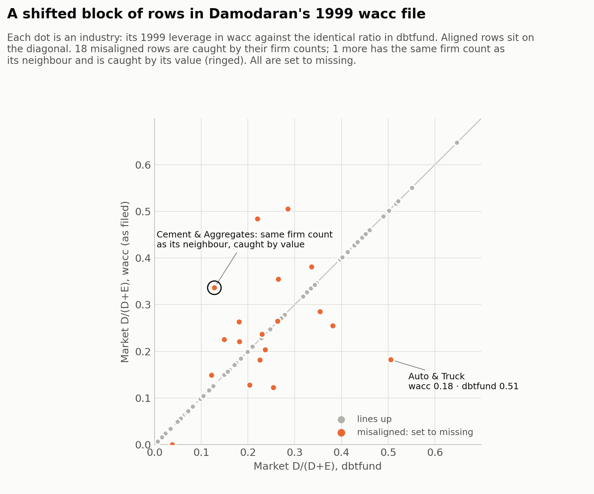

# Does the Payout–Leverage Relationship Vary with the Interest Rate Regime?

[](https://github.com/MilanKalajdzic/Master-Thesis/actions/workflows/tests.yml)
[](pyproject.toml)
[](LICENSE)

**When interest rates rise, do more indebted industries cut their payouts harder?**

<p align="center">
<picture>
  <source media="(prefers-color-scheme: dark)" srcset="docs/img/hero-dark.png">
  
</picture>
</p>

*The payout-on-leverage slope, year by year, over three rate cycles. If debt service crowded out payouts when
rates are high, the shaded years would sit lower; they do not, systematically. Pooled over all years, the slope is
+0.38 in low-rate years and +0.28 in high-rate years.*

Master's thesis in Quantitative Finance, Faculty of Economic Sciences, University of Warsaw.
Author: Milan Kalajdžić · Supervisor: dr hab. Piotr Boguszewski · *Work in progress*

The repository holds the whole empirical pipeline for 140 US non-financial industries
over 27 years (1999–2025): loading Damodaran's industry files, checking them, building
the panel, estimation, robustness, tables and figures. It uses only public data (Damodaran, NYU Stern and FRED),
so every number can be reproduced from scratch, and the pipeline is tested on fake data with known answers.

**Contents:** [Short version](#short-version) · [Hypotheses](#research-question-and-hypotheses) ·
[Data and method](#data-and-method) · Results: [leverage and payout](#leverage-and-payout) ·
[H2](#h2-a-bounded-null) · [other leverage measures](#other-leverage-measures) · [H3](#h3-not-supported) ·
[H1 and dividend smoothing](#h1-and-dividend-smoothing) · [Data quality](#data-quality) ·
[Design decisions](#design-decisions-and-why) · [Setup](#setup-and-reproduce) · [Tests](#tests) ·
[Layout](#repository-layout) · [Limitations](#limitations)

## Short version

- **Leverage and payout move together.** In years when an industry's leverage is above its own average, it pays
  out more (+0.34, p = 0.022): the complementarity view, not the substitution (free-cash-flow) view.
  The link survives robust standard errors, firm weights, dropping the financial crisis and holding capital
  spending fixed; in first differences it is about as large but imprecise.
- **H1: no.** More levered industries do not cut dividends more in hiking years
  (lev(t−1) × hiking year +0.0015, p = 0.53), nor in high-rate years or as the fed funds rate rises.
- **H2: no detectable regime effect.** β₂ = −0.095 (p = 0.53). The 95% interval rules out regime
  effects larger than 0.052 in the payout ratio per SD of leverage
  (14% of the mean payout). None of 19 payout specifications finds an
  effect, and neither do three other leverage measures or Debt/EBITDA × the fed funds rate, the closest available
  proxy for interest burden.
- **H3: not supported.** The estimate points the other way (−1.18, p = 0.031), but it
  leans on the 2023–2025 cycle and does not survive the multiple-testing adjustment (Romano–Wolf
  p = 0.071): an exploratory pattern.
- **Dividends are smoothed** (Lintner speed of adjustment 0.09–0.36 a year), with no detectable
  difference between rate regimes.
- **Damodaran's files needed fixing.** The pipeline's checks find a block of shifted rows in `wacc99`, doubled
  net income in `divfcfe07`, payouts that contradict the dividend file, an inflated market cap in `divfund` 2001
  and 2004, a depreciation break in the 2013–2015 capex files, and definition changes in leverage (leases, 2013),
  PP&E (2013, 2016) and capital spending (2013); total payout switches to a net figure in 2014–2015. Each is handled
  in code.
- **Tested.** On fake files with a planted effect and planted defects, the pipeline recovers the effect and
  catches the defects; 49 tests run on every push, on Python 3.10–3.14.

## Research question and hypotheses

Does the relationship between corporate leverage and payout policy depend on whether interest rates are
high or low?

| | Hypothesis | Test | Expected |
|---|---|---|---|
| **H1** | More leveraged industries cut payouts more when rates rise (debt service crowds out distributions) | change in dividends on lagged leverage × hiking year | < 0 |
| **H2** | The payout–leverage slope is more negative in high-rate regimes *(main contribution)* | β₂ on leverage × high-rate | β₂ < 0 |
| **H3** | High asset tangibility stabilises the relationship across regimes (lower refinancing risk) | leverage × high-rate × tangibility | > 0 |

The baseline slope β₁ is not itself a hypothesis: the substitution (free-cash-flow) view predicts it negative,
the complementarity view positive.

## Data and method



- **Panel:** 140 non-financial, non-utility US industries over 27 years (1999–2025), 2,116 industry-years
  (unbalanced: industries enter, leave and are reclassified). 1,879 of them, from 138 industries, have every
  variable of the main models. A *stable core* of 46 industries present ≥ 20 years is a robustness sample.
- **Sources:** Damodaran industry files `divfund` (payout, ROE, market cap), `divfcfe` (dividends, net income,
  FCFE, buybacks), `wacc` (market leverage D/(D+E), tax rate), `dbtfund` (PP&E / total assets, book and lease-free
  leverage, EBITDA/EV, capital spending), `capex` (capex-based tangibility proxies); FRED (fed funds rate, 10y
  Treasury, BAA–AAA spread, real GDP).
- **Rate regime:** a year is *high-rate* if the annual-average fed funds rate is ≥ 3%, which gives three
  separate episodes (1999–2001, 2005–2007, 2023–2025). A 2022–2025 dummy (the latest tightening cycle) and the
  continuous rate are reported as alternatives. For H1, a *hiking year* is one in which the annual-average fed
  funds rate rose by at least 25bp.
- **Tangibility (H3):** PP&E / total assets, as the industry's percentile rank within each year (the variable's
  definition changes over time, see [data quality](#data-quality)).
- **Model:** two-way fixed effects (industry and year), standard errors clustered by industry:

$$\text{payout}_{it}=\beta_1\,\text{lev}_{it}+\beta_2\,(\text{lev}_{it}\times\text{HighRate}_t)+\gamma_1\text{ROE}_{it}+\gamma_2\text{tax}_{it}+\gamma_3\text{size}_{it}+\alpha_i+\delta_t+\varepsilon_{it}$$

Year fixed effects absorb every variable that only varies over time (the regime dummy, GDP growth, the
credit spread). Those variables enter through interactions, or in a separate industry-FE-only specification.
With industry fixed effects, each coefficient compares an industry with itself over time.

## Results

Payout ratios are only defined for positive net income, so industry-years with net income ≤ 0 are excluded from
the payout-ratio models (1,879 observations). All results are associational.

### Leverage and payout

Leverage is *positively* related to payout: +0.342 (SE 0.149, p = 0.022) with industry and year
fixed effects. In years when an industry's leverage is above its own average, it pays out more. That is the
opposite of the substitution (free-cash-flow) view, in which debt and dividends are alternative ways to discipline
managers, and in line with the complementarity view. The estimate survives standard errors robust to common
shocks, weighting by the number of firms and dropping the financial crisis. Holding capital spending fixed lowers
it to +0.31 (p = 0.048): part of the association is shared with how much industries invest. In first
differences, which use only year-to-year changes, it is about as large (+0.36) but imprecise (SE 0.24,
p = 0.14) ([stress test](outputs/tab_stress_leverage.csv)):

| Stress test | Leverage coef. | SE | p | β₂ (lev × high) | p | N |
|---|---:|---:|---:|---:|---:|---:|
| Industry-clustered SE (main) | +0.342 | 0.149 | 0.022 | −0.095 | 0.535 | 1879 |
| Two-way clustered SE | +0.342 | 0.156 | 0.029 | −0.095 | 0.523 | 1879 |
| Driscoll–Kraay SE (3 lags) | +0.342 | 0.097 | < 0.001 | −0.095 | 0.479 | 1879 |
| First differences (+ year FE) | +0.358 | 0.244 | 0.144 | −0.063 | 0.651 | 1622 |
| Weighted by number of firms | +0.369 | 0.169 | 0.029 | −0.087 | 0.570 | 1879 |
| Excluding 2008–2009 | +0.388 | 0.165 | 0.018 | −0.116 | 0.476 | 1732 |
| Capital spending as a control | +0.311 | 0.157 | 0.048 | −0.113 | 0.461 | 1879 |

### H2: a bounded null

<p align="center">
<picture>
  <source media="(prefers-color-scheme: dark)" srcset="docs/img/h2_bounds-dark.png">
  
</picture>
</p>

The regime interaction is close to zero and nowhere near significance (β₂ = −0.095, SE 0.153,
p = 0.53); the leverage slope is +0.378 in low-rate years and +0.283 in high-rate
years. A null result is only informative if the test could have found a meaningful effect. The 95% interval
for β₂ is [−0.395, +0.205]. Scaled by the standard deviation of leverage in the estimation sample (0.132),
it rules out regime effects larger than 0.052 in the payout ratio per 1 SD of leverage
(14% of the mean payout of 0.36); per SD of leverage within
industries (0.072), the variation the fixed-effects estimate uses, the bound is 0.028.
An equivalence test (TOST) rejects effects above 0.046 at the 5% level, and the design has
80% power against an effect of 0.057 (the minimum detectable effect). Across the other
payout-ratio specifications the bound is 0.042–0.069, except the 2022–2025 dummy
(0.114), which uses the least regime variation. At a margin of ±0.05
(about 14% of the mean payout), equivalence holds in 11 of the 16 payout-ratio
specifications with a regime dummy, including the main one: the data rule out large regime effects, but cannot show everywhere that
the effect is below 0.05 ([table](outputs/tab_power_bounds.csv)).

One regression points the other way. With the log dividend yield as the dependent variable, the interaction is
+0.93 (p = 0.024): a *stronger* leverage link in high-rate years. The yield is not a payout ratio,
and yield and D/(D+E) both contain market equity (a lower share price raises both), so its leverage terms are
partly mechanical; it is reported, but not counted among the H2 specifications.

<details>
<summary><b>All 19 payout specifications</b> (β₂, the leverage × regime term), and the yield regression</summary>

| Specification | Term | Coef. | SE | p | N |
|---|---|---:|---:|---:|---:|
| Main (two-way FE) | lev × high | −0.095 | 0.153 | 0.535 | 1879 |
| Stable core (46 industries) | lev × high | −0.091 | 0.178 | 0.610 | 1088 |
| Regime = 2022–2025 dummy | lev × high | −0.267 | 0.304 | 0.380 | 1879 |
| Continuous rate | lev × FFR | −0.025 | 0.036 | 0.490 | 1879 |
| DV = Dividends / FCFE | lev × high | −0.249 | 0.648 | 0.701 | 1587 |
| DV = (dividends + buybacks) / NI, 2013 and 2016+ | lev × high | −0.668 | 1.180 | 0.572 | 740 |
| Two-way clustered SE | lev × high | −0.095 | 0.149 | 0.523 | 1879 |
| Excluding 2020–2021 | lev × high | −0.093 | 0.152 | 0.541 | 1758 |
| Excluding 2008–2009 | lev × high | −0.116 | 0.162 | 0.476 | 1732 |
| Capital spending as a control | lev × high | −0.113 | 0.154 | 0.461 | 1879 |
| Lagged leverage | lev(t−1) × high | −0.079 | 0.167 | 0.636 | 1703 |
| Industry FE + macro controls | lev × high | −0.192 | 0.167 | 0.250 | 1879 |
| Without ROE | lev × high | −0.141 | 0.169 | 0.405 | 1879 |
| Backward elimination of controls | lev × high | −0.098 | 0.155 | 0.527 | 1879 |
| Payout as reported (incl. net income ≤ 0) | lev × high | −0.060 | 0.144 | 0.677 | 1974 |
| Payout incl. the rows that contradict `divfcfe` | lev × high | −0.045 | 0.138 | 0.745 | 1893 |
| Driscoll–Kraay SE | lev × high | −0.095 | 0.134 | 0.479 | 1879 |
| First differences | Δ(lev × high) | −0.063 | 0.138 | 0.651 | 1622 |
| Weighted by number of firms | lev × high | −0.087 | 0.153 | 0.570 | 1879 |
| *Not a payout ratio:* DV = log dividend yield | lev × high | +0.935 | 0.414 | 0.024 | 1884 |

</details>

### Other leverage measures

The hypotheses are about debt *service*, and market D/(D+E) is only a rough gauge of it: it moves with share
prices and includes capitalised leases from 2013 on. Interest coverage is only reported from 2022, so the closest
panel measure is Debt/EBITDA (debt relative to operating cash flow), built as D/(D+E) ÷ (EBITDA/EV) and checked
against Damodaran's own figure where he reports it. The positive leverage–payout relation holds for every measure,
and the regime interaction is null for every measure, including Debt/EBITDA × the fed funds rate, the nearest
thing to an interest-burden test ([table](outputs/tab_alt_leverage.csv)). The Debt/EBITDA interval is the widest:
it rules out effects above 0.071 per SD.

| Leverage measure | Leverage coef. | p | × high-rate | p | per 1 SD | 95% bound per SD | N |
|---|---:|---:|---:|---:|---:|---:|---:|
| Market D/(D+E), main (leases from 2013) | +0.342 | 0.022 | −0.095 | 0.535 | −0.013 | 0.052 | 1879 |
| Market D/(D+E), without leases | +0.371 | 0.011 | −0.106 | 0.517 | −0.014 | 0.055 | 1879 |
| Book D/(D+E) | +0.634 | < 0.001 | −0.030 | 0.734 | −0.005 | 0.032 | 1877 |
| Debt / EBITDA | +0.052 | 0.002 | −0.018 | 0.355 | −0.023 | 0.071 | 1876 |
| Debt / EBITDA × fed funds rate (per pp) |  |  | −0.003 | 0.540 | −0.003 | 0.014 | 1876 |

Two caveats. Debt/EBITDA and the payout ratio both have earnings in the denominator; with the log dividend yield
as the dependent variable the Debt/EBITDA coefficient is −0.05 (p = 0.14), so its
positive link with payout may be partly mechanical. Book leverage rises mechanically when payouts shrink book
equity, and it is missing where book equity is negative (restaurants, tobacco and home-improvement retail in
recent years).

### H3: not supported

<p align="center">
<picture>
  <source media="(prefers-color-scheme: dark)" srcset="docs/img/h3_tangibility-dark.png">
  
</picture>
</p>

With tangibility measured as PP&E / total assets, the triple interaction is −1.18
(SE 0.55, p = 0.031). In high-rate years the leverage–payout slope *rises* by
0.45 (p = 0.04) for the least tangible industries (10th percentile) and *falls* by 0.50
(p = 0.10) for the most tangible (90th percentile): the regime effect is about as large at both ends, with
opposite signs, so tangible industries are not the stable ones H3 expected. The sign is negative in every variation
below, and the term stays significant at 5% with Driscoll–Kraay and two-way clustered errors, dropping 2020–2021,
weighting by firms, the continuous rate and two of the three capex-based proxies (Net Cap Ex/Sales
p = 0.022, Invested capital/Sales p = 0.036; Cap Ex/Depreciation
−0.19, p = 0.27); a time-invariant tangibility gives
−1.17 (p = 0.043). These are regression
p-values; the cluster bootstrap, run for the five tangibility measures, keeps only the main one below 5%, and
barely (p = 0.0496). PP&E and capital spending are correlated, but the term is −1.16 (p = 0.031)
with capital spending as a control and −1.82
(p = 0.014) when capital spending gets the same interactions as tangibility, so
it is not capital spending in disguise. It weakens to −1.07
(p = 0.07) without 2008–2009 and is not significant in the stable core
(−0.61, p = 0.33)
([sensitivity](outputs/tab_H3_robustness.csv), [proxies](outputs/tab_H3_proxy_robustness.csv)).

Is it fragile? ([leave-one-out](outputs/tab_H3_leave_one_out.csv), [multiple testing](outputs/tab_multiple_testing.csv))

- *No single industry drives it.* Dropping any one of the 138 industries leaves the term between
  −1.34 and −0.86, significant at 5% in 135 cases and at
  10% in all.
- *It leans on the latest tightening cycle.* Dropping 1999–2001 leaves it at −1.48
  (p = 0.045), dropping 2005–2007 at −1.38
  (p = 0.054); dropping 2023–2025 halves it to −0.63
  (p = 0.12). Of the single years, only dropping 2023 (−0.72, p = 0.14) or 2009 (−1.06, p = 0.052) takes p above
  0.05.
- *It does not survive the multiple-testing adjustment.* The industry-cluster bootstrap (9,999 draws) gives
  p = 0.0496 unadjusted. Adjusted for testing H2 and H3 together, p = 0.099 (Holm, on the
  bootstrap p-values) and 0.071 (Romano–Wolf, which accounts for the correlation between the
  tests); adjusted across the five tangibility measures, p = 0.17 (Romano–Wolf). Both families
  are small, so even these adjustments understate how many specifications were tried.

So H3 is not supported, and the opposite pattern (the payout–leverage link weakening in high-rate years for
asset-heavy industries and strengthening for asset-light ones) is exploratory: it comes mostly from the 2023–2025
cycle and is not established once the number of tests is accounted for. It is still a reason not to read the H2
null as "no effect anywhere": opposite responses may average out.

### Other findings

- The strong negative ROE coefficient is largely mechanical. ROE is negatively related to the payout ratio
  (−1.68, p < 0.001) and to Dividends/FCFE (−3.87, p < 0.001), but both
  contain net income in the denominator (FCFE includes net income). With the log dividend yield (dividends ÷
  market cap), which contains no earnings, the ROE coefficient is +1.12 (p < 0.001): more
  profitable industries pay more relative to their market value, not less ([table](outputs/tab_roe_check.csv)).
  The leverage terms of the yield regression are not interpreted, because yield and D/(D+E) both contain market
  equity; for the same reason the yield is not one of the H2 specifications.
- The effective tax rate is negatively related to payout (−0.54, p < 0.001).
- Tangibility on its own (in a model without the interactions) is not related to payout once industry effects are
  in (PP&E rank +0.10, p = 0.34). Cap Ex/Depreciation is negatively related
  (−0.095, p < 0.001), which mostly reflects investment intensity
  rather than asset tangibility.

### H1 and dividend smoothing

Industry dividends adjust slowly toward a target payout (Lintner, 1956): the speed of adjustment is between
0.09 and 0.36 per year (pooled and within estimates, which should bracket the true value). The
payout *ratio* itself is far less persistent (0.18–0.47), because it moves with earnings.
Smoothing shows no detectable difference between rate regimes (p = 0.44).

H1 is a statement about changes, so it is tested in the same dividend-change equation: do more levered
industries cut dividends more when rates rise? They do not, and the interval is tight: for an industry one SD
(0.14) more levered, the hiking-year change in dividends lies between
−2.9% and +5.7% of last year's dividends (95% interval), so a cut beyond about
3% is ruled out ([bound](outputs/tab_H1_bound.csv)). The change models drop 2013, when Damodaran's
reclassification moves firms between industries, and do not use `divfcfe`'s 2000 and 2007 figures, not even as
last year's value ([table](outputs/tab_lintner.csv)):

| Change-form test of H1 | Coef. | SE | p | N |
|---|---:|---:|---:|---:|
| **lev(t−1) × hiking year (fed funds up ≥ 25bp): the H1 test** | +0.0015 | 0.0023 | 0.528 | 1623 |
| lev(t−1) × high-rate year | +0.0012 | 0.0040 | 0.766 | 1623 |
| lev(t−1) × change in fed funds rate | +0.0008 | 0.0011 | 0.477 | 1623 |
| lev(t−1) × high-rate year, stable core | +0.0031 | 0.0029 | 0.285 | 941 |
| lev(t−1) × hiking year, without 2002 and 2005 | +0.0015 | 0.0026 | 0.570 | 1463 |

The thesis figures and every table are in [`outputs/`](outputs).

## Data quality

<p align="center">
<picture>
  <source media="(prefers-color-scheme: dark)" srcset="docs/img/data_alignment-dark.png">
  
</picture>
</p>

The checks below are computed on every run and write their tables to `outputs/`. They find the problems; the fixes (which
rows or years to drop, when a definition changes) are set in the configuration from what the tables show, so a
new download with a new problem shows up in the tables but is not fixed automatically.

- **Row alignment (1999).** An industry has the same number of firms in every file of a year, so matching
  firm counts confirm that each row belongs to its name. In `wacc99` a block of 18 industries (Aluminum to
  Chemical (Specialty), four of them banks) is shifted by one row: Auto & Truck, for example, carries Apparel's
  leverage (0.18 instead of 0.51). The counts catch 17 of them, plus one financial
  industry whose count also differs. The 18th, Cement & Aggregates, has the same number of firms as the neighbour whose data it carries;
  a second check catches it: everywhere else in that file-year, wacc's D/(D+E) is the very same number as
  dbtfund's market debt ratio, and here it is 0.34 against 0.13. Leverage and the tax rate are set to missing for
  these rows. In `divfcfe00` and `dbtfund08` the counts differ for most industries: a different vintage of
  the universe rather than a shift. `divfcfe00` is excluded by the next check; `dbtfund08` lines up by value (its
  PP&E ranks correlate 0.97 with 2007, its debt ratio 0.98 with `wacc08`) and is kept
  ([table](outputs/tab_data_check_alignment.csv)).
- **Cross-file check (2000, 2007).** `divfund`'s payout ratio should equal dividends ÷ net income
  from `divfcfe`; it does (within 5%) for 93–100% of industries in every year except
  2000 (the other vintage) and 2007, where `divfcfe`'s net income is about twice what the payout ratio implies
  (it matches exactly for banks). Every measure built from `divfcfe` (Dividends/FCFE, total payout, the dividend
  yield, and the dollar figures of the change models, also as lags) is excluded in those years
  ([table](outputs/tab_data_check_crossfile.csv)); the main payout variable comes from `divfund` and is unaffected.
  In the other years the check also runs row by row: 14 payouts that differ from `divfcfe`'s
  dividends ÷ net income by more than 25% are set to missing; half of them are near zero although net income is
  positive (Drugs (Biotechnology) 2022: 0.0006 against 13.2). They matter: with them, β₂ is
  −0.045 instead of −0.095.
- **Market cap (2001 and 2004).** `divfund`'s market cap is inflated: non-financial total
  $26tn and $31tn against $14–16tn around them, for the typical industry
  1.6 and 2.1 times the average of the two neighbouring years; nearly the same factor for every
  industry in 2004, less so in 2001 ([table](outputs/tab_data_check_mktcap.csv)). Size enters in logs and the
  dividend-yield checks use the log yield, so the year effects absorb the common part. The change models, which
  scale by last year's market cap, give the same results without 2002 and 2005 (hiking-year term
  +0.0015, p = 0.57; speed of adjustment 0.38).
- **Capex depreciation break (2013–2015).** In Damodaran's 2013–2015 capex files, industry depreciation
  roughly halves while capex does not (Total Market: $908bn in 2012 → $368bn in 2013 → $719bn in 2016).
  This inflates Cap Ex/Depreciation and scrambles the industry ranking, so the depreciation-based proxies
  (robustness checks for H3) are set to missing in those years ([figure](outputs/fig_data_check_tangibility.png),
  [table](outputs/tab_data_check_yearly_medians.csv)).
- **Leverage and leases (2013).** From 2013 on, `wacc`'s D/(D+E) capitalises operating leases (it equals
  `dbtfund`'s lease-adjusted ratio exactly); before 2013 it equals `dbtfund`'s plain market debt ratio in most years
  (not in 2001, 2002 and 2008, where the two files compute it differently). The main leverage measure therefore
  changes definition in 2013, most for lease-heavy industries. ASC 842 put operating leases on public companies'
  balance sheets from fiscal 2019, and from 2020 on the two ratios almost coincide. The lease-free ratio gives the
  same results.
- **PP&E / assets (2013, 2016).** `dbtfund` labels it Fixed Assets / BV of Capital (1999–2012), Fixed Assets /
  Total Assets (2013–2016) and Net PP&E / Total Assets (2017+), but the values change basis in 2013 and 2016: the
  industry ordering reshuffles (rank correlation with the previous year 0.78 and 0.83, against
  0.96–0.99 in the other years except 2000, 0.85) and the median drops from 0.26 to
  0.20 in 2016, while 2017 lines up with 2016 (0.99; [table](outputs/tab_data_check_ppe_rank_stability.csv)).
  Tangibility is therefore used as a within-year percentile rank, and the time-invariant H3 variant averages
  over the reshuffles.
- **Capital spending (2013).** The capital spending control is scaled by book capital up to 2012 and by
  total assets from 2013, so its median drops from 0.062 to 0.039 in 2013. Like PP&E it enters as a
  within-year percentile rank.
- **Total payout (2014–2015).** `divfcfe` reports dividends + buybacks from 2013, but in 2014 and 2015 only net of
  stock issuance, a different quantity (in 2016, when both exist, net/gross has a median of 0.89 across all
  industries and is negative for about 5% of them; a one-off comparison, not a pipeline check). Those two years
  are missing; the loader reads only the gross column.
- **Debt / EBITDA.** Damodaran reports it only in 2018 and 2022+, so it is built from D/(D+E) and EBITDA/EV. In
  the years where both exist the two rank industries alike (rank correlation 0.87–0.96); the constructed level is
  about 10–20% lower because EV nets out cash ([table](outputs/tab_data_check_debt_ebitda.csv)). Interest
  coverage, the direct measure of debt-service burden, exists only from 2022 on and is not used.
- **Undefined ratios.** Payout (dividends ÷ net income), Dividends/FCFE, total payout ÷ net income and ROE (net
  income ÷ book equity) are meaningless when the denominator is ≤ 0, yet the files report values there:
  95 loss-making industry-years have a median payout of 0.002 although they pay dividends,
  and 15 industry-years have an ROE whose sign contradicts their net income (e.g. tobacco
  2014–2020; in some of them book equity is negative). These are set to missing (`POSITIVE_DENOMINATORS` in the
  configuration), and whether earnings are positive is read from net income (from ROE only where net income is
  missing or unreliable). The payout including the loss-making years is kept as a robustness
  check ([table](outputs/tab_data_check_undefined_ratios.csv)).
- **Industry reclassification (2012→2013).** Damodaran moved to a new industry scheme. Names are reconciled
  with a conservative rename map ([Appendix B](outputs/appendix_B_rename_map.csv)): spelling variants and clear
  one-to-one relabels only, so an industry that was split (Computer Software/Svcs in 2011) is left alone. The
  stable-core sample checks whether anything hinges on the reconciliation.
- **Three file layouts.** Sheet names, header rows and column names change across 1999–2012, 2013–2018 and
  2019+ (`divfund` from 2020). The loader finds the table, the columns and the data year automatically.

## Design decisions (and why)

1. **Industry level, public data.** Damodaran's industry averages are free, so anyone can rerun everything.
   The price is that firm-level heterogeneity is averaged away (see [limitations](#limitations)).
2. **The regime is a rate threshold, not a date.** Fed funds ≥ 3% (annual average) gives three separate
   high-rate episodes; a 2022–2025 dummy would compare one episode with 23 very different years. Both, and the
   continuous rate, are reported.
3. **Two-way fixed effects with industry-clustered errors.** Industry effects remove permanent differences
   between sectors, year effects remove everything common to a year (including the regime itself, which then
   enters only through interactions). Driscoll–Kraay errors, two-way clustering and a cluster bootstrap check
   the inference.
4. **Undefined ratios are missing, not small.** A payout ratio with negative earnings, Dividends/FCFE with
   negative FCFE, book leverage with negative book equity, or an ROE that contradicts net income carry no
   information about the concept.
5. **Ranks where a definition changes.** PP&E / assets and capital spending are compared within each year,
   because their definitions change over time; year effects cannot absorb a change that reorders industries.
6. **A null is reported as a bound.** The confidence interval and an equivalence test say how large an effect
   the data rule out, and the minimum detectable effect how sensitive the design is, instead of "no effect".
7. **Many tests, adjusted.** The H3 result is re-estimated without each industry, year and episode, and its
   p-value is adjusted within its family of tests (Holm and Romano–Wolf on a cluster bootstrap), because it
   emerged from a long specification list.
8. **Checks are code, fixes are configuration.** Firm counts, identities between files, market-cap totals and
   per-year medians are computed and tabulated on every run; the break years and exclusions they revealed are
   set in the configuration, where they can be read and changed.
9. **The notebook decides, the package works, the tests check.** The notebook holds the research choices and
   the narrative; `src/paylev` holds the machinery; the tests run both on fake data with known answers.

## Setup and reproduce

Linux or macOS (on Windows, use `.venv\Scripts\python` in place of `.venv/bin/python`):

```bash
git clone https://github.com/MilanKalajdzic/Master-Thesis.git
cd Master-Thesis
python3 -m venv .venv
.venv/bin/python -m pip install -e ".[dev]"        # the package in src/, plus notebook and test tools
.venv/bin/python -m pytest                         # under a minute, on fake data: no downloads needed
.venv/bin/python scripts/download_damodaran.py     # 135 files -> data/raw/  (see data/README.md)
.venv/bin/python scripts/run_notebook.py           # reruns the notebook in place; tables and figures -> outputs/
.venv/bin/python scripts/readme_figures.py         # redraws the README figures -> docs/img/
```

For the exact package versions behind the committed outputs, run
`.venv/bin/python -m pip install -r requirements-lock.txt` before the `-e ".[dev]"` step.
`scripts/run_notebook.py` runs the notebook with the venv's Python from the repo root, whatever Jupyter kernels
are registered on the machine. In VS Code, open the repo folder and pick the `.venv` kernel; if the package isn't
installed, the notebook falls back to the copy in `src/`.

FRED data come from a pinned snapshot (`data/fred/fred_snapshot.csv`: monthly series 1998–2025, quarterly GDP
1997–2025), so results match exactly. Set `FRED_SOURCE = "live"` in the configuration cell to download the
current vintage (needs the `fred` extra). A full run takes about three minutes, most of it the 9,999-draw
bootstrap in §10b, which is seeded (`RW_SEED`), so it reproduces too.

### Tests

The tests need no downloads. `paylev.synthetic` writes fake Damodaran files for 1999–2025 in the same three
layouts as the real archive, with the real column names of each era, and plants in them:

- a known effect: payout = … + 0.3 × leverage − 0.4 × leverage × high-rate year − 1.0 × ROE + noise;
- the defects found in the real files: a block of rows shifted against the industry names (as in `wacc99`),
  including one row whose neighbour has the same firm count; a year with net income at twice its value (as in
  `divfcfe07`); a payout near zero that contradicts the dividend file's dividends ÷ net income; total payout
  reported only net of stock issuance in 2014–2015; and an industry with negative book equity, whose ROE is negative
  while its net income is positive;
- a financial and a utility industry, an industry renamed at the 2013 reclassification, and a newest file
  without year digits.

The whole notebook then runs on these files (`tests/test_notebook.py`). It has to finish without errors,
write every output the repo ships, recover the planted coefficients and catch every planted defect, and the
README figures are drawn from its outputs. So the null results on the real data are not a coding artefact: the
same code finds a planted effect of the same kind (whether the real data could detect a real effect is what the
bounds above answer). Unit tests cover the file readers across layouts, the alignment and cross-file checks, the
sample construction, the estimators (the fast estimator used for the refits must equal PanelOLS, standard errors
included), Holm and Romano–Wolf, the figure style and the download script against a fake server. GitHub Actions
runs them on every push, on Python 3.10, 3.12, 3.13 and 3.14, and on 3.11 with the pinned versions.

## Repository layout

```
thesis_analysis.ipynb        the analysis, top to bottom (sections map to thesis chapters 4-6 and appendices)
src/paylev/
  damodaran.py               find and read Damodaran's files across their three layouts, one year's rows
  sample.py                  reconciliation, exclusions, row-alignment and cross-file checks, winsorising
  macro.py                   FRED: pinned snapshot or live download, annual averages, the rate regime
  estimation.py              two-way FE panel regressions (PanelOLS) and a fast numpy version for refits
  inference.py               Holm, Romano-Wolf and the industry-cluster bootstrap
  synthetic.py               fake Damodaran files with planted effects and defects, for the tests
  plotting.py                figure style shared by the thesis and README figures (colours, themes, PNG export)
tests/                       pytest suite (no downloads needed)
scripts/
  download_damodaran.py      fetches the 135 Damodaran industry files (5 datasets, 1999-2025)
  run_notebook.py            reruns the notebook with this Python, from the repo root
  readme_figures.py          draws the README figures (light and dark) from outputs/
  refresh_fred_snapshot.py   re-downloads the FRED series into the snapshot
data/
  README.md                  what each file holds, naming, download
  raw/                       Damodaran .xls files (not committed; downloaded)
  fred/fred_snapshot.csv     FRED monthly/quarterly series used in the thesis
outputs/                     regression tables (CSV + LaTeX), robustness tables, appendices, thesis figures
docs/img/                    README figures
.github/workflows/tests.yml  the test run on every push
pyproject.toml               the package, its dependencies and the dev/fred extras
requirements.txt             the same install, for pip install -r
requirements-lock.txt        exact versions behind the committed outputs
LICENSE                      Apache-2.0
```

## Limitations

- Industry aggregation hides firm heterogeneity: the data are a repeated cross-section of industry averages,
  not a firm panel, and any regime dependence at the firm level may average out.
- The regime changes only from year to year, and there are three high-rate episodes, so the evidence on the
  interactions rests on few regime switches; the H3 pattern rests mostly on the last one.
- The regime is built from annual averages of the fed funds rate. So 2019 counts as a hiking year (the average
  rose after the 2018 hikes, although the Fed cut in 2019), and 2004 does not (the hikes began in June).
- Tangibility (PP&E / assets) and capital spending change definition over time, so only their within-year
  ranking is used.
- Payout ratios are noisy when earnings are near zero (winsorised at 1%/99%).
- The data are Damodaran's industry aggregates as published, with the fixes above; a problem no check covers
  may remain.
- Identification is associational, not causal.

## License and data

Code: Apache-2.0 (see `LICENSE`). Data belong to their providers: Aswath Damodaran (NYU Stern, industry
datasets) and the Federal Reserve Bank of St. Louis (FRED).
